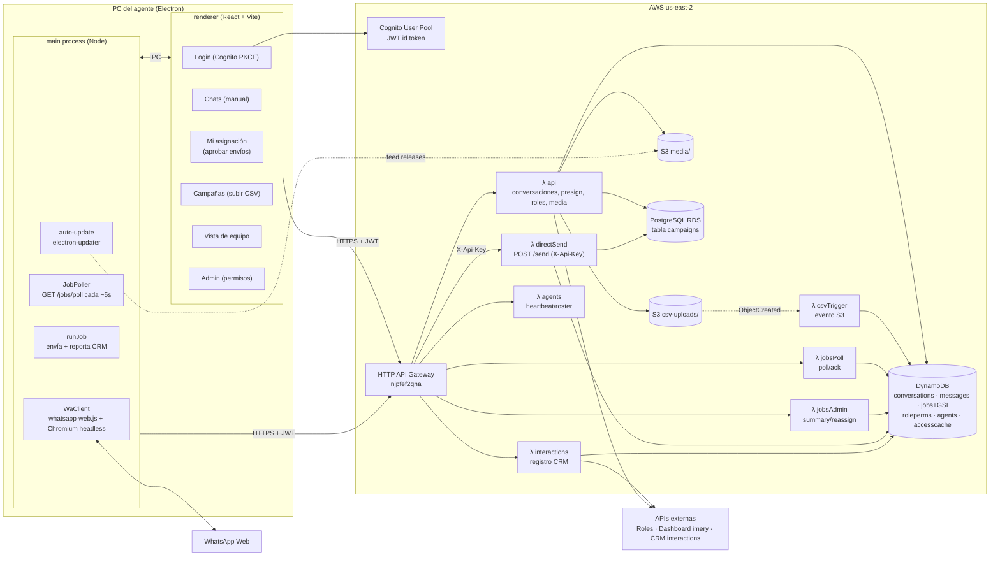
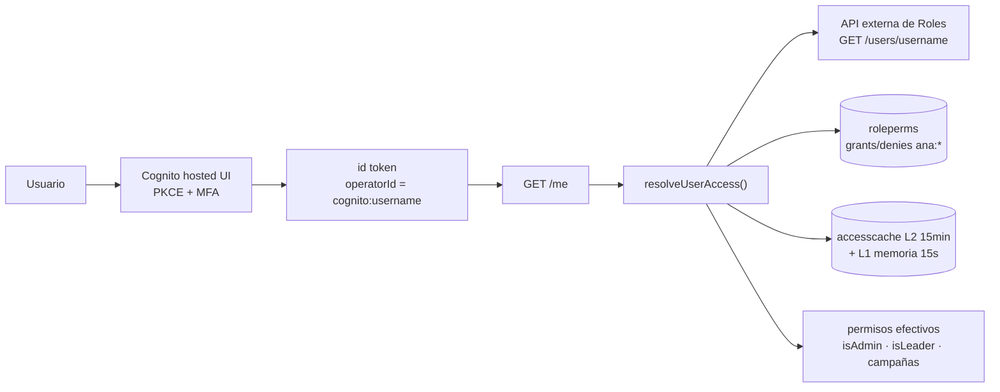
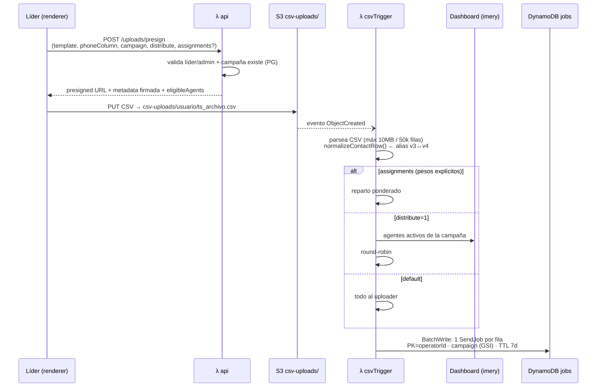
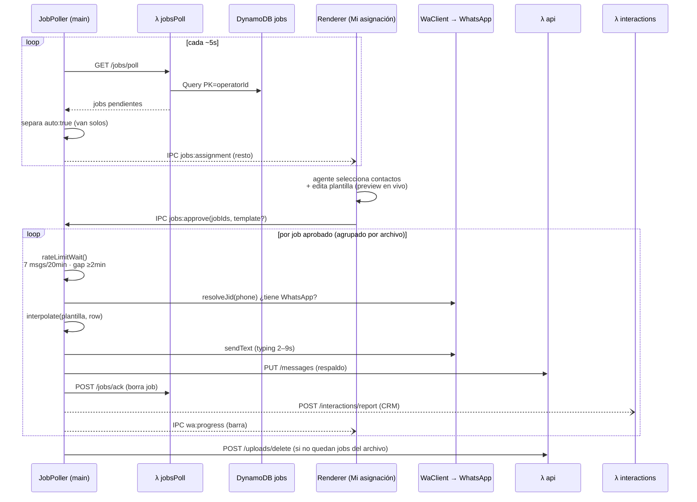
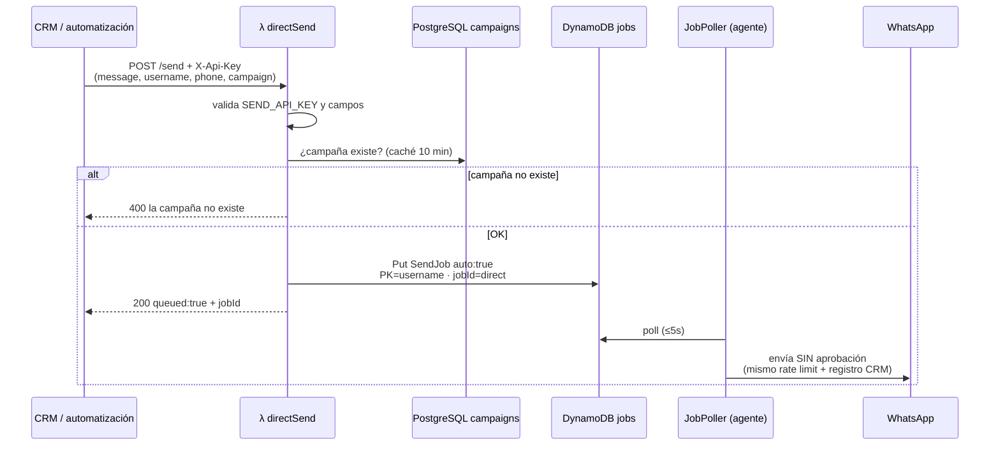
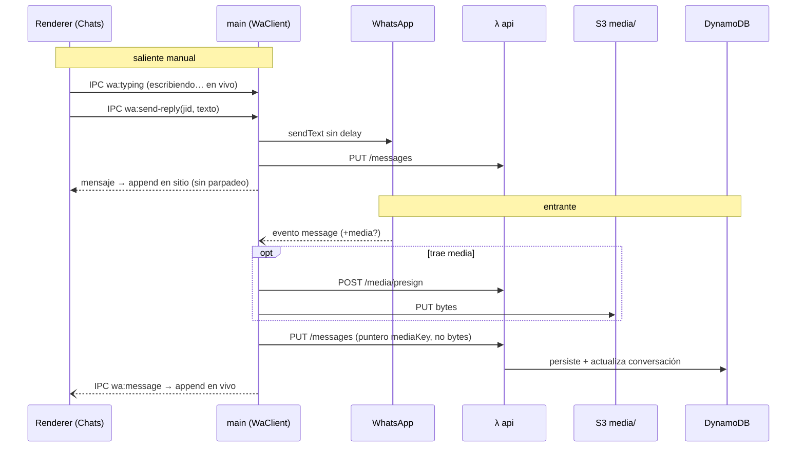
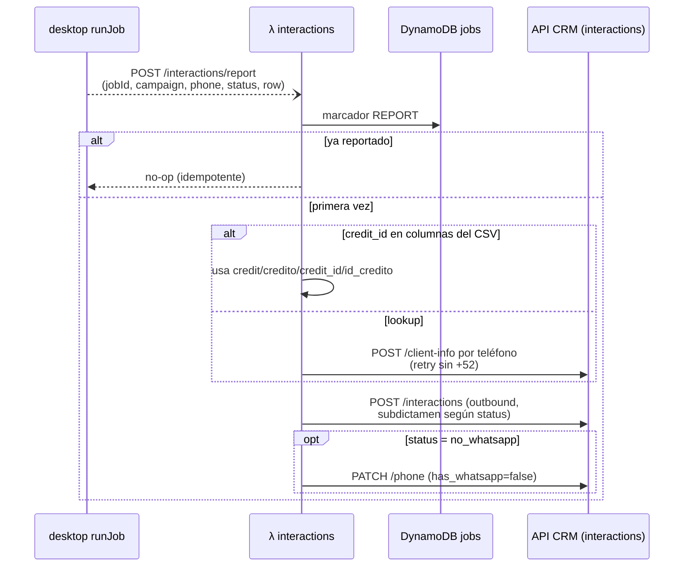
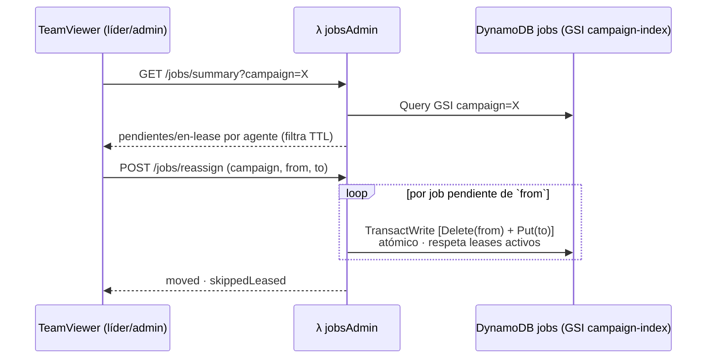
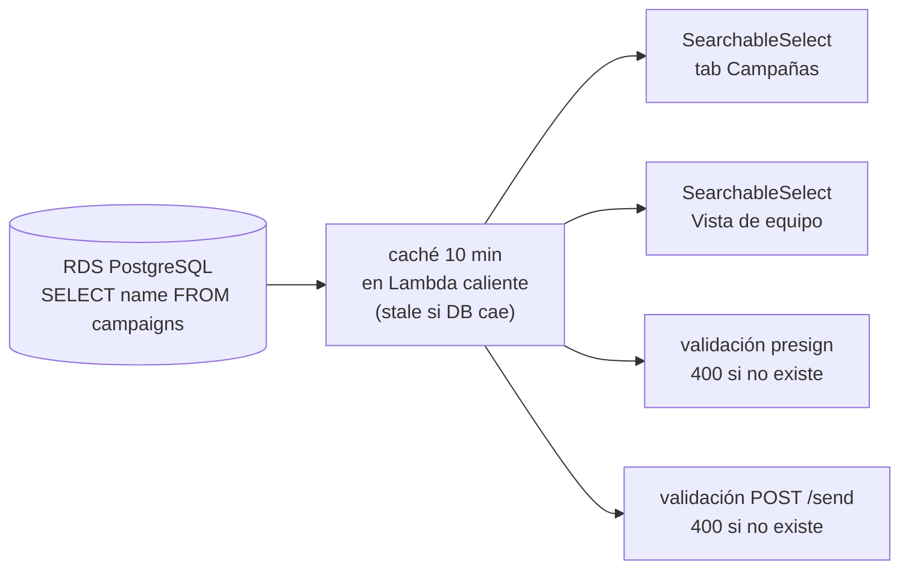
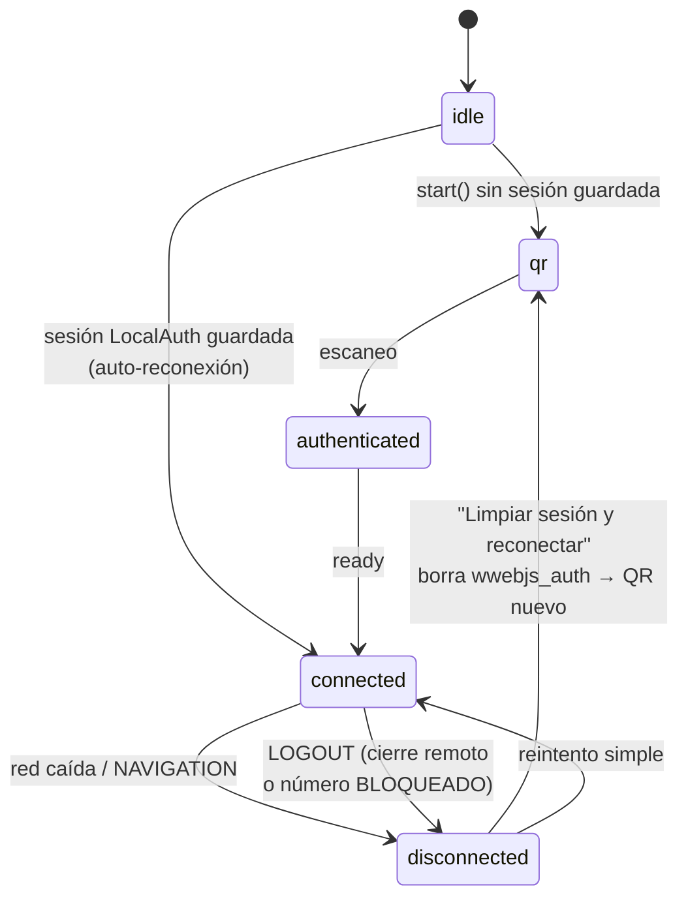

# ana v4 — Arquitectura y flujos

> Estado al 2026-06-10 (incluye: aprobación de asignación, envío directo, registro CRM, compat CSV v3, reparto/reasignación por agente). Complementa `ARCHITECTURE.md` y `CONTEXT.md`; este documento describe **cómo fluye todo de punta a punta**. Diagramas en Mermaid.

---

## 1. Topología general

Híbrido: WhatsApp vive **local** en la PC del agente (la sesión de Chromium no sobrevive Lambdas); AWS solo guarda datos, permisos y orquesta trabajo.

## 2. Identidad y permisos

1. Login: Cognito hosted UI + PKCE loopback → **id token** (el authorizer valida `aud`, solo presente en id tokens). Claim `cognito:username` = `operatorId` = partición de TODOS los datos del agente.
2. `GET /me` → `resolveUserAccess()`: roles de la API externa → permisos `ana:*` locales (tabla `roleperms`) → unión de grants/denies + defaults (chats view/reply). Caché L1 memoria 15s, L2 DynamoDB 15 min.
3. Especiales: superadmin `erick.silva` (todo); rol con nombre ~ `/l[ií]der/` → upload, distribute, team view, jobs view/manage automáticos.
4. **Hard checks** (no dependen del flag `PERMISSIONS_ENFORCED`): consola admin, subir CSV (solo líder/admin/grant explícito), summary/reassign de jobs.

## 3. Flujo: campaña masiva (CSV → asignación → envío)

### 3.1 Subida y trigger (líder, tab Campañas)

- La **config viaja firmada** en la metadata del objeto S3 (`x-amz-meta-*`): el cliente no puede alterarla después del presign.
- Validaciones del presign: solo líder/admin sube; `distribute` requiere permiso; la campaña debe ser propia **y existir** en la DB (si no → `400 la campaña "X" no existe`).
- `eligibleAgents` en la respuesta = preview del reparto (misma fuente que usará el trigger).

### 3.2 Poll, aprobación y envío (agente)

- **Nada se envía sin aprobación** (excepto los directos `auto:true`, §4). Lo no seleccionado queda pendiente y reaparece en cada poll.
- La vista "Mi asignación" se hidrata al montar (`jobs:get-assignment`), no espera al siguiente poll.
- CSV de S3 se borra solo cuando **no quedan jobs** de ese archivo.

## 4. Flujo: envío directo (sistema-a-sistema)

Ver `ENVIO_DIRECTO.md` para la guía de integración. Único camino que envía **sin aprobación**; las campañas del líder siempre pasan por Mi asignación.

## 5. Flujo: chat manual + entrantes (conviven con la automatización)

Una sola sesión `whatsapp-web.js` headless; bot y humano no compiten por ninguna ventana (envíos por API interna, no por DOM como en v3). Manual **no cuenta** al rate limit de campaña.

Lectura: `GET /conversations` y `GET /conversations/{chatId}/messages` (partición propia; líder/admin pueden pedir `?operatorId=` de un agente de sus campañas — solo lectura).

## 6. Flujo: registro CRM

API key del CRM solo en backend; fire-and-forget (CRM caído no frena envíos).

## 7. Flujo: supervisión y reasignación (líder/admin)

Reemplazo del consume-once de v3: agente caído a media campaña → el líder mueve sus pendientes sin re-subir CSVs. Panel en TeamViewer (refresh 30s). Heartbeat: el desktop avisa al conectar WA y cada 5 min → tabla `agents`; activo = visto en <10 min.

## 8. Campañas (PostgreSQL)

- Conexión: `DATABASE_URL` o campos sueltos `PGHOST/PGPORT/PGUSER/PGPASSWORD/PGDATABASE` (estilo pgAdmin); TLS cifrado sin verificación de CA.
- Dropdowns solo permiten **elegir** opciones existentes (escribir filtra, no setea).

## 9. Tablas DynamoDB

| Tabla | Keys | Contenido |
|---|---|---|
| `conversations` | PK=operatorId, SK=chatId | último mensaje, unreadCount |
| `messages` | PK=`<op>#<chatId>`, SK=`<ts>#<msgId>` | mensajes (punteros de media, no bytes) |
| `jobs` | PK=operatorId, SK=jobId · **GSI** `campaign-index` (campaign, operatorId) | cola de envío; TTL 7 días; `auto` para directos; marcadores `REPORT#` de idempotencia CRM |
| `roleperms` | PK/SK single-table | grants/denies `ana:*` por rol |
| `agents` | PK=campaign, SK=operatorId | roster con heartbeat (`lastSeen`) |
| `accesscache` | PK=username, TTL | caché L2 de acceso resuelto |

## 10. Sesión de WhatsApp y salud

- Watchdog 60s al iniciar (sin señal → aviso de Chromium/red).
- En `LOGOUT`/`auth_failure` la UI explica el posible bloqueo y ofrece el reset. Las conversaciones **no se pierden**: viven en DynamoDB y se recargan solas tras reescanear.

## 11. Distribución y updates

- Build: `npm run publish` → Electron Builder → instalador NSIS → release a S3.
- Al arrancar, `electron-updater` consulta el feed S3: update **obligatorio y bloqueante** (gate antes del login) → toda la flota corre la misma versión. Despliegue masivo vía GPO/Intune.
- Backend: `serverless deploy` (Serverless Framework v4; secretos en `backend/.env`, ver `.env.example`).

## 12. Secretos (backend/.env, gitignored)

| Variable | Uso |
|---|---|
| `ROLES_API_KEY` | API externa de Roles & Permisos |
| `DASHBOARD_API_KEY` | API de agentes (imery) para el reparto |
| `INTERACTIONS_API_KEY` / `INTERACTIONS_USER_ID` | registro CRM |
| `SEND_API_KEY` | autentica `POST /send` |
| `PGHOST/PGPORT/PGUSER/PGPASSWORD/PGDATABASE` (o `DATABASE_URL`) | PostgreSQL de campañas |

## 13. Mapa de código

| Flujo | Archivos |
|---|---|
| Presign/upload CSV | `backend/src/handlers/api.ts` (presignCsv) · `desktop/src/routes/Campaigns.tsx` |
| Trigger CSV → jobs | `backend/src/handlers/csvTrigger.ts` · `backend/src/lib/contacts.ts` |
| Poll/ack | `backend/src/handlers/jobsPoll.ts` · `desktop/electron/jobs/poller.ts` |
| Aprobación | `desktop/src/routes/Assignment.tsx` · IPC en `desktop/electron/main.ts` |
| Envío + plantillas | `desktop/electron/main.ts` (runJob) · `desktop/electron/whatsapp/client.ts` · `whatsapp/template.ts` |
| Envío directo | `backend/src/handlers/directSend.ts` · `ENVIO_DIRECTO.md` |
| CRM | `backend/src/handlers/interactions.ts` · `backend/src/lib/interactions.ts` |
| Summary/reassign | `backend/src/handlers/jobsAdmin.ts` · `desktop/src/routes/TeamViewer.tsx` |
| Campañas (PG) | `backend/src/lib/db.ts` · `backend/src/lib/campaignsDb.ts` |
| Acceso/permisos | `backend/src/lib/access.ts` · `permissions.ts` · `rolePerms.ts` · `roles.ts` |
| Chat manual/entrantes | `desktop/src/routes/Chats.tsx` · `backend/src/handlers/api.ts` (messages/media) |
