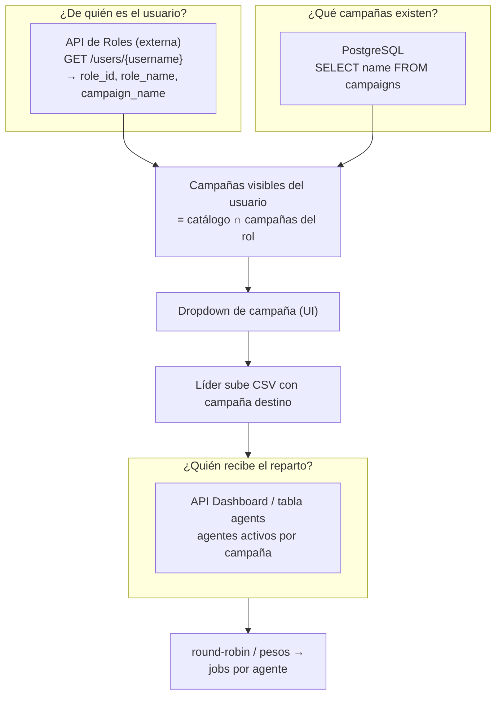
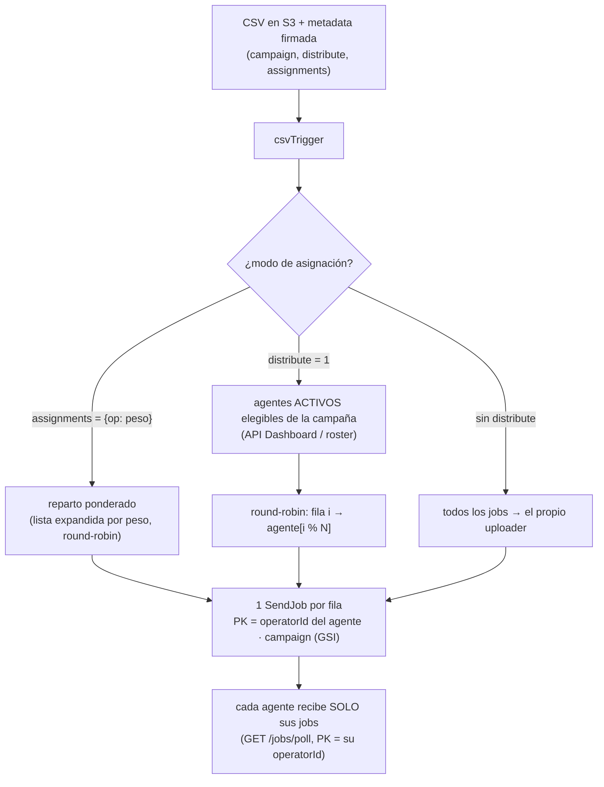

# Campañas y asignación de contactos — guía reutilizable

Cómo se obtienen las campañas de un usuario y cómo, cuando un líder sube contactos, se decide **a qué agentes se asignan**. Pensado como patrón portable a otros proyectos del ecosistema (Pernexium), no solo ana.

---

## 0. Resumen del patrón

Hay **tres fuentes distintas** y cada una responde una pregunta diferente. No las confundas:

| Fuente | Pregunta que responde | Dónde |
|---|---|---|
| **API de Roles** (externa) | ¿A qué campañas pertenece este usuario? (identidad) | `GET /users/{username}` |
| **Tabla `campaigns`** (PostgreSQL) | ¿Qué campañas existen en el sistema? (catálogo) | `SELECT name FROM campaigns` |
| **API del Dashboard / roster** | ¿Qué agentes activos hay para repartir en una campaña? | `GET /users/campaign/{campaign}` + heartbeat |

La **lista que ve un usuario** = catálogo (PostgreSQL) ∩ sus campañas (API de Roles).
El **reparto** = filas del CSV repartidas entre los **agentes activos** de la campaña destino.



---

## 1. Campañas del usuario (identidad)

La **fuente de verdad de identidad** es la API externa de Roles. Un usuario tiene N roles; cada rol trae su `campaign_name`. Las campañas del usuario son el conjunto de `campaign_name` de sus roles.

```
GET {ROLES_API_BASE}/users/{username}
Header: X-Api-Key: {ROLES_API_KEY}

→ { "roles": [
      { "role_id": "...", "role_name": "Líder DIDI VIP", "campaign_name": "didi_vip",
        "permissions": [ { "permission_name": "ana:..." } ] },
      ...
] }
```

- `username` = el claim `cognito:username` del JWT (en ana es el `operatorId`).
- **Gotcha**: los permisos vienen *inline* como `permission_name`, NO en un endpoint aparte. No llames `/roles/{id}/permissions`.
- Caso `campaign_name = "*"` o rol admin → ve **todas** las campañas (global).
- Si la API falla, devuelve `[]` pero **no caches el vacío** como "sin campañas": un outage no debe convertirse en denegación. (Ver `resolveUserAccess` en ana.)

Implementación de referencia: `backend/src/lib/roles.ts` (`getUserRoles`), `backend/src/lib/access.ts` (`resolveUserAccess` → arma `campaigns: string[]`).

---

## 2. Catálogo de campañas (qué existe)

Las campañas que existen en el sistema viven en **PostgreSQL**:

```sql
SELECT name FROM campaigns;
```

- Conexión por `DATABASE_URL` o campos sueltos `PGHOST/PGPORT/PGUSER/PGPASSWORD/PGDATABASE` (estilo pgAdmin). TLS cifrado.
- **Cachear**: las campañas cambian poco y se consultan seguido. En ana se cachea 10 min en memoria del Lambda caliente; si la DB cae se sirve lo último (stale > vacío). Ver `backend/src/lib/campaignsDb.ts`.

Implementación: `backend/src/lib/db.ts` (pool) + `campaignsDb.ts` (`listCampaignsDb`, `campaignExists`).

---

## 3. Lo que el usuario ve (catálogo ∩ identidad)

El endpoint que alimenta el dropdown cruza ambas fuentes:

```
GET /agents/campaigns   (con JWT)
```

Lógica (`backend/src/handlers/agents.ts` → `campaignsList`):

```
all = listCampaignsDb()                    // catálogo PostgreSQL
if (isAdmin || campaigns incluye "*")  → devuelve all
else                                   → all.filter(c => campañas-del-rol.has(c))
```

- **Admin / global**: ve todo el catálogo.
- **Líder / agente**: solo las campañas de sus roles que además existen en el catálogo.

En el front, un dropdown **buscable y solo-elegir** (no acepta texto libre) consume esta lista → así nunca se manda una campaña inexistente. Ver `desktop/src/ui/SearchableSelect.tsx` y `desktop/src/routes/Campaigns.tsx`.

---

## 4. Subida del líder y asignación (a dónde van los contactos)

El líder elige una **campaña destino** (paso 3) y sube el CSV. La campaña viaja **firmada** en la metadata del objeto S3 (presigned PUT) — el cliente no puede alterarla después.

```
POST /uploads/presign  { campaign, distribute, assignments?, template, phoneColumn }
  → valida: el usuario puede subir (líder/admin), la campaña es suya y EXISTE
  → presigned URL con metadata firmada (operatorId, campaign, distribute, …)
PUT  {presigned}  → S3 csv-uploads/{usuario}/{ts}_{archivo}.csv
```

El evento `ObjectCreated` dispara el trigger, que decide los **destinatarios** de los jobs:



### Quién es "agente activo elegible"

Para `distribute=1` el trigger pide el roster de la campaña (en ana, API del Dashboard `imery`):

```
GET {DASHBOARD_BASE_PATH}/users/campaign/{campaign}
Header: X-Api-Key: {DASHBOARD_API_KEY}
→ usuarios; se filtran:
   · active === true
   · email externo (no interno @pernexium / @dirsa)
   · si la campaña exige rol (env AGENT_ROLE_<CAMPAÑA>), debe traerlo
```

Alternativa interna (sin Dashboard): la tabla `agents` con **heartbeat**. Cada desktop hace `POST /agents/heartbeat` al conectar WhatsApp y cada 5 min; "activo" = `lastSeen` < 10 min. Ver `backend/src/lib/agents.ts`.

### El reparto en sí

- **round-robin**: `targets[i % targets.length]` por fila. Reparto parejo.
- **ponderado** (`assignments = {operatorId: peso}`): se expande la lista (`{a:2,b:1}` → `[a,a,b]`) y se aplica el mismo round-robin → respeta proporciones.
- **sin distribute**: el uploader se queda todos (revisa/envía él mismo).

Cada job se escribe con `PK = operatorId` del agente destino → el aislamiento es natural: en `GET /jobs/poll` cada agente consulta solo su partición. Un GSI `campaign-index` permite al líder ver el total por campaña y **reasignar** pendientes de un agente caído a otro (`POST /jobs/reassign`).

Implementación: `backend/src/handlers/csvTrigger.ts`, `backend/src/lib/dashboard.ts`, `backend/src/handlers/jobsAdmin.ts`.

---

## 5. Checklist para portar a otro proyecto

1. **Identidad**: cliente de la API de Roles (`X-Api-Key`), `getUserRoles(username)` → extrae `campaign_name` de cada rol. No caches el vacío.
2. **Catálogo**: conexión a la DB de campañas, `SELECT name FROM campaigns`, con caché corta.
3. **Cruce**: endpoint que devuelve `catálogo ∩ roles` (admin = todo). Aliméntalo a un dropdown buscable que no acepte texto libre.
4. **Validación server-side**: al recibir una campaña (subida o acción), verifica que el usuario la tenga y que exista en el catálogo. Nunca confíes en el cliente.
5. **Reparto**: define "agente activo" (roster externo o heartbeat propio) y aplica round-robin o pesos. Escribe el trabajo particionado por destinatario para aislar el consumo.
6. **Reasignación**: indexa el trabajo por campaña (GSI) para poder mover pendientes si un agente cae.

## 6. Variables de entorno relevantes (backend)

| Variable | Para qué |
|---|---|
| `ROLES_API_BASE` / `ROLES_API_KEY` | API de identidad/roles del usuario |
| `DASHBOARD_BASE_PATH` / `DASHBOARD_API_KEY` | roster de agentes activos por campaña |
| `AGENT_ROLE_<CAMPAÑA>` | (opcional) rol requerido para ser elegible en esa campaña |
| `PGHOST/PGPORT/PGUSER/PGPASSWORD/PGDATABASE` o `DATABASE_URL` | catálogo de campañas (PostgreSQL) |

> Todas son secretos de **backend** (`backend/.env`), nunca del cliente. El desktop solo manda el JWT; el backend resuelve identidad, catálogo y roster.
